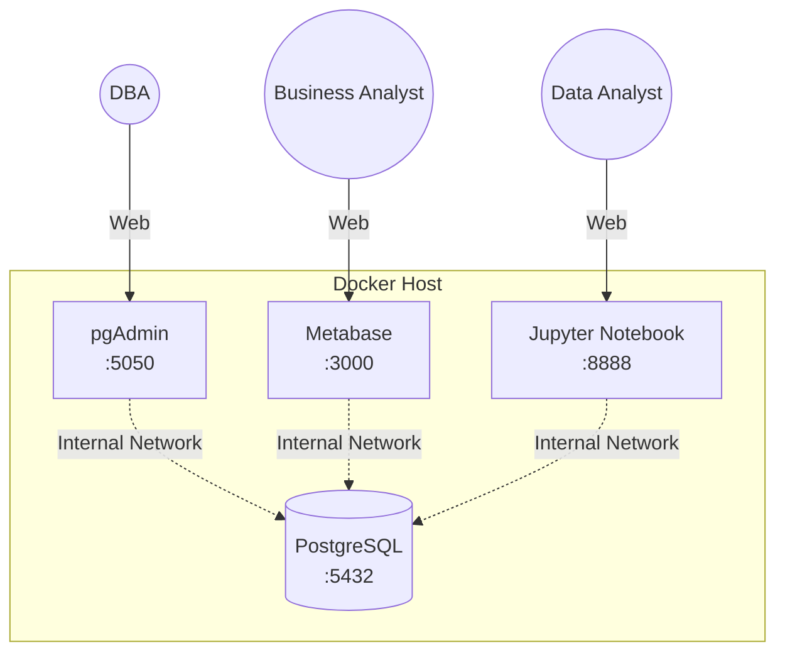

# Open Source Self-Serve Analytics Using Docker

Welcome to the **Open Source Self-Serve Analytics** ecosystem project. This repository contains the configuration and codebase to spin up a fully functioning, local analytics stack using open-source tools and Docker.

## Project Overview

The goal of this project is to provide a complete analytics infrastructure suitable for learning, prototyping, or adapting into a production environment. 

By running a single command, you will spin up:
- **PostgreSQL**: The central relational database.
- **pgAdmin**: A web-based database administration tool.
- **Metabase**: A self-service Business Intelligence (BI) and visualization platform.
- **Jupyter Notebook**: A Python data science environment with Pandas and SQLAlchemy.

This project also doubles as an educational course, found in the `course/` directory, teaching you how to build this stack from scratch.

## Architecture



## Technology Stack

- **Containerization**: Docker & Docker Compose
- **Database**: PostgreSQL
- **Database Administration**: pgAdmin 4
- **Business Intelligence**: Metabase
- **Data Analysis**: Python, Jupyter, Pandas, SQLAlchemy

## Prerequisites

To run this project, you need:
- [Docker Desktop](https://www.docker.com/products/docker-desktop) installed and running.
- Git (optional, for cloning the repository).
- A web browser.
- A code editor (like VS Code).

## Getting Started

### 1. Initial Setup
1. Clone this repository.
2. Copy the environment variables template:
   - Windows: `copy .env.example .env`
   - Mac/Linux: `cp .env.example .env`
3. (Optional) Open `.env` in a text editor and change the default passwords.

### 2. Start the Ecosystem
Run the following command in the project root directory:
```bash
docker compose up -d
```
Docker will download the necessary images, build the custom Jupyter image, and spin up all 4 containers in the background.

### 3. Access the Services
Once running, you can access the tools through your web browser:

| Service | URL | Default Credentials (from `.env.example`) |
|---|---|---|
| **pgAdmin** | http://localhost:5050 | `admin@analytics.com` / `admin_secure_password` |
| **Metabase** | http://localhost:3000 | Create your own admin account on first load. |
| **Jupyter** | http://localhost:8888 | Run `docker logs jupyter` to find the login token. |

*Note: PostgreSQL is running on port `5432` but does not have a web UI. Connect to it using the hostname `postgres` from within pgAdmin, Metabase, or Jupyter.*

## Managing the Ecosystem

**To view logs:**
```bash
docker compose logs -f
```

**To stop the ecosystem:**
```bash
docker compose down
```
*(This stops the containers, but your database data and Jupyter notebooks are safely saved on your hard drive!)*

**To reset the data completely:**
If you want to destroy the database and trigger the initialization scripts to run again on the next boot:
```bash
docker compose down -v
```
*(Warning: The `-v` flag deletes the persistent volume containing all PostgreSQL data).*

## Project / Course Structure

This repository is built incrementally across several modules:

- `course/01-introduction/`: What we are building and why.
- `course/02-docker-fundamentals/`: Docker basics for analytics.
- `course/03-postgresql/`: Setting up the central database.
- `course/04-pgadmin/`: Connecting the administration tool.
- `course/05-sql-and-data/`: Loading the mock e-commerce dataset.
- `course/06-metabase/`: Building BI dashboards.
- `course/07-jupyter-python/`: Analyzing data with Python and Pandas.
- `course/08-complete-stack/`: Tying it all together with Docker Compose.
- `course/09-final-project/`: The final demonstration.

Navigate to the `course/01-introduction/` folder to begin!
