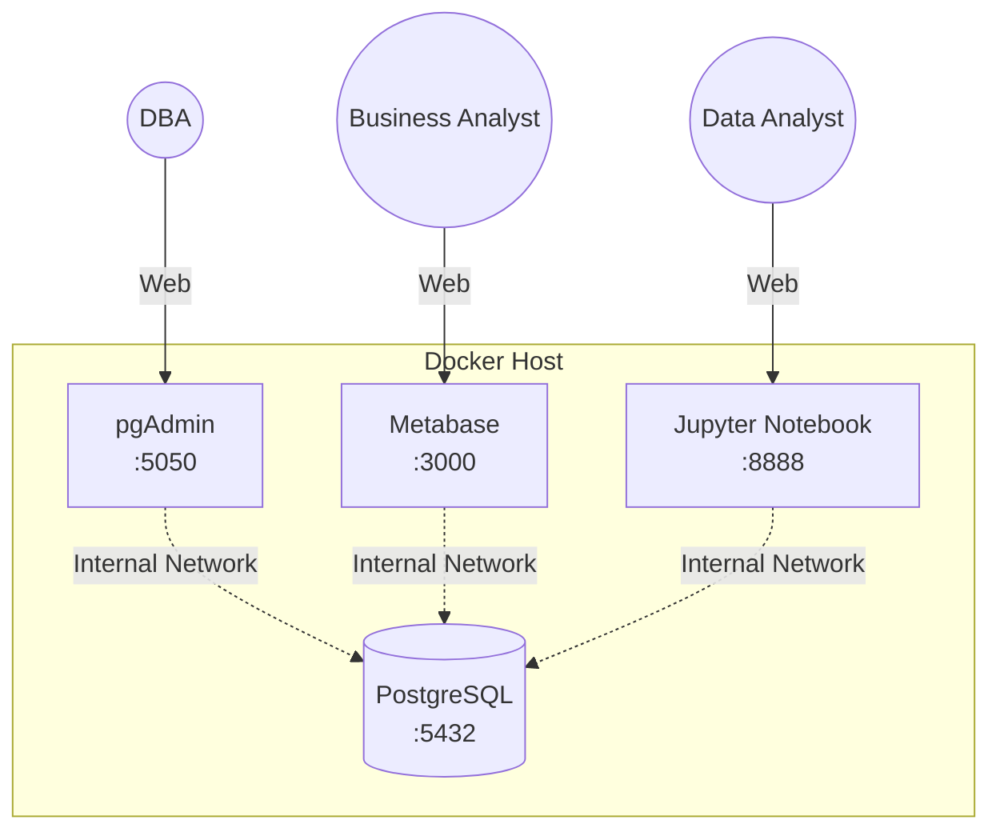

# Module 1: Introduction

## 1. Learning Objectives
By the end of this module, you will understand:
- The goal of this course and the final project.
- Why an open-source analytics stack is valuable.
- The high-level architecture of the self-serve ecosystem we are building.

## 2. Concept Explanation

### What is Self-Serve Analytics?
Self-serve analytics empowers business users, data analysts, and non-technical staff to explore data and create reports without relying on a dedicated data engineering team. By providing a centralized database and intuitive tools (like Metabase), organizations can make data-driven decisions faster.

### Why Open Source?
Open-source tools provide immense value without the vendor lock-in or licensing costs of commercial enterprise software. This ecosystem relies entirely on free, community-driven tools:
- **PostgreSQL**: The world's most advanced open-source relational database.
- **pgAdmin**: A feature-rich administration interface for PostgreSQL.
- **Metabase**: A beautiful, user-friendly BI tool that lets you build dashboards without needing to know SQL.
- **Jupyter Notebook**: The industry standard for interactive Python data analysis.

### Why Docker?
We will use Docker to run all these services. Docker packages software into standardized units called **containers**. This ensures that the analytics stack runs exactly the same way on your laptop as it would on a colleague's laptop or in a production server. No more "it works on my machine" problems!

## 3. Architecture Overview

Throughout this course, we will build the following architecture layer by layer:

### The Data Flow
1. **Storage**: All data is stored in **PostgreSQL**.
2. **Administration**: Database Administrators (DBAs) use **pgAdmin** to manage users, inspect table structures, and run ad-hoc SQL maintenance queries.
3. **Business Intelligence**: Business Analysts use **Metabase** to ask questions (using a GUI or SQL), build charts, and compile dashboards.
4. **Advanced Analysis**: Data Scientists and Analysts use **Jupyter Notebooks** to extract data using Python, manipulate it with Pandas, and build predictive models or complex visualizations.

## 4. Summary
We are building a robust, free, and self-serve data analytics environment. We will start by learning the absolute basics of Docker, and then we will systematically add each component to our ecosystem. 

In the next module, we will cover the fundamentals of Docker required to build this project.
